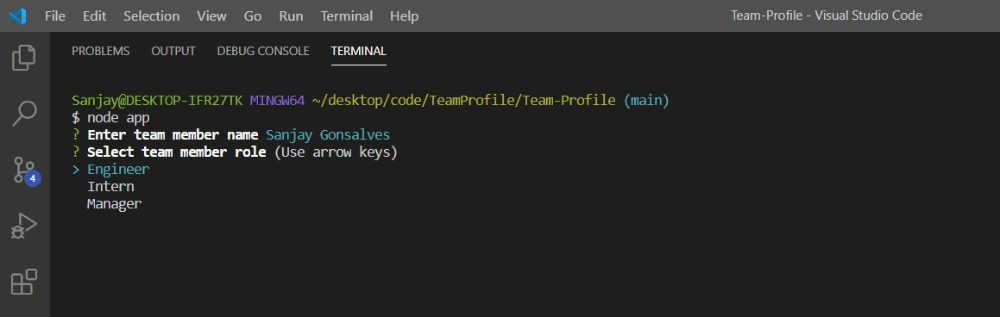
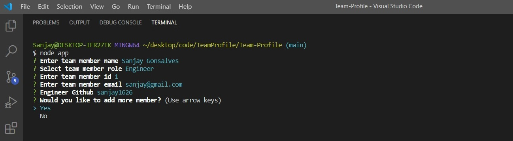
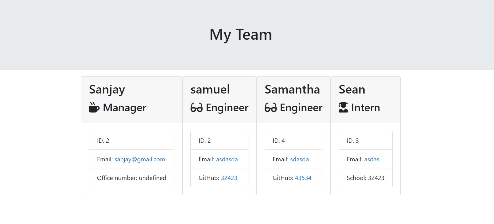

# Team Profile

   
  
  Check out the badges hosted by [shields.io](https://shields.io/).

## Description 
This project was designed as a homework assignment for UCSD Extension Web Development bootcamp.
  
The Team Profile Generator is a command-line-input application run in Node that requests information from the user about members of an engineering team and generates an HTML file displaying that information. Before running the application the user must perform an npm install to install all required dependencies.

Upon launching the app, the user is asked to describe the first member of their team. The user enters the team member's name, selects that member's role from a list (options include "Engineer," "Intern," and "Manager), enters the member's ID (any string) validates if its a string or integer and returns error if string, enters the member's email address, and then must enter another piece of information that will differ depending on what role was selected. If "Engineer" was selected, the app asks the user for the team member's GitHub username; if "Intern" was selected, the member's school is requested; and if "Manager" was chosen, the user is prompted for the team member's phone number.

# Getting Started
This project has been deployed to GitHub Pages. To get this project up and running, you can follow the deployment link.
   * [GitHub Respository](https://github.com/sanjay1626/Team-Profile.git) 
   * [Deployed GitHub IO](https://sanjay1626.github.io/Team-Profile/)

# Installation
To install this application, you will need a text editor. I recommend Visual Studio Code.
To generate team profile, first run `npm install` in order to install the following npm package dependencies as specified in the `package.json`:
  * [`inquirer`](https://www.npmjs.com/package/inquirer) that will prompt you for your inputs from the command line 
  * [`fs`](https://www.npmjs.com/package/fs) to access file system
  

The application itself can be invoked with `node app.js`.

# Usage
* [Video demo of Team Profile-generator]()

The user initializes the application in the command line with node app.js. The user is prompted to choose what type of employee they would like to create first. The options are engineer, intern, and manager.

The engineer option requires the user to input the name, ID, email, and github username.

The intern option requires the user to input the name, ID, email, and school.

The manager option requires the user to input the name, ID, email, and office number.

Once all the information is collected, the user chooses to create another employee or not by selection "Yes" or "No".

If they choose "Yes", the employee type question appears and they go through the same process.

If they choose "No", the html page is generated with all the employees created.

Below is the HTML Team Profile display

## License

MonkeyBrain Inc. 

---
# Languages
  * JavaScript
  * Node.js
  * ES6
  * OOP

## Questions?

 

Feel free to contact me with examples or any questions via the information below:

GitHub: [@sanjay1626](https://api.github.com/users/sanjay1626)

Email: snjgonsalves@gmail.com
